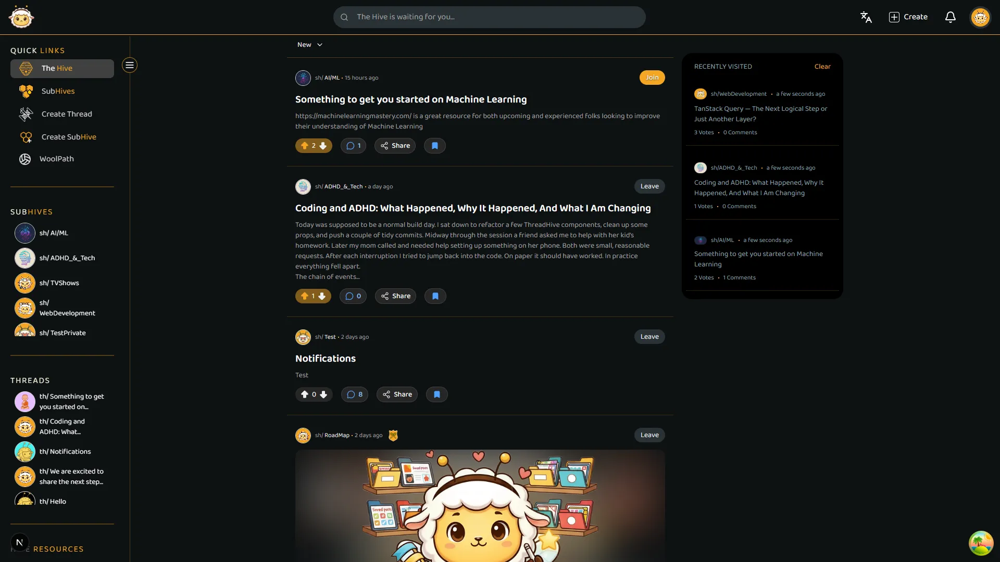
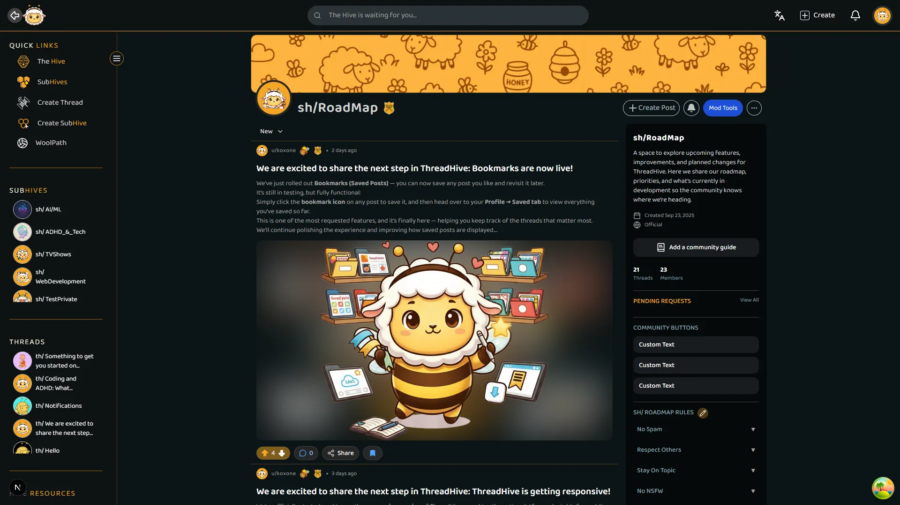
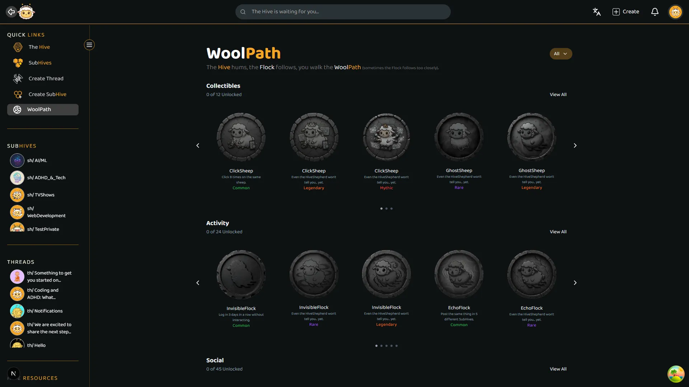
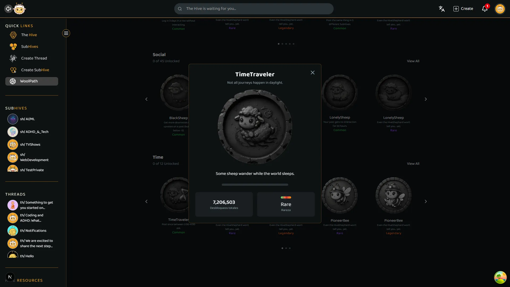
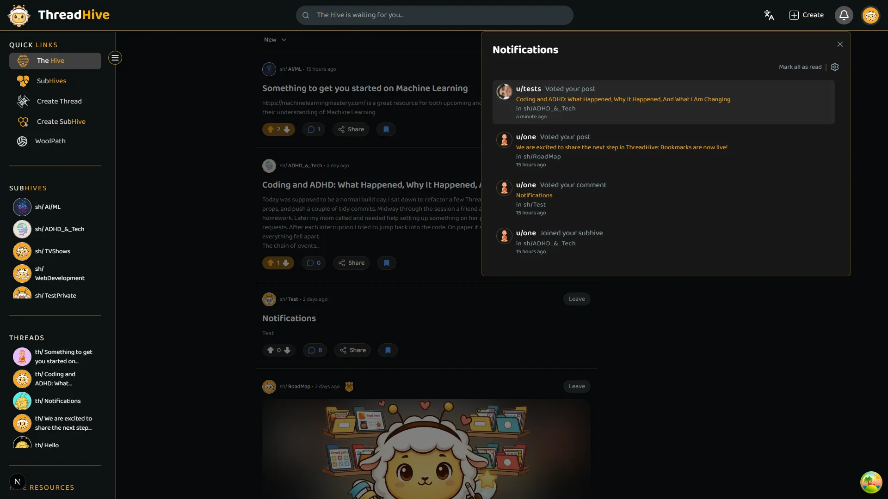
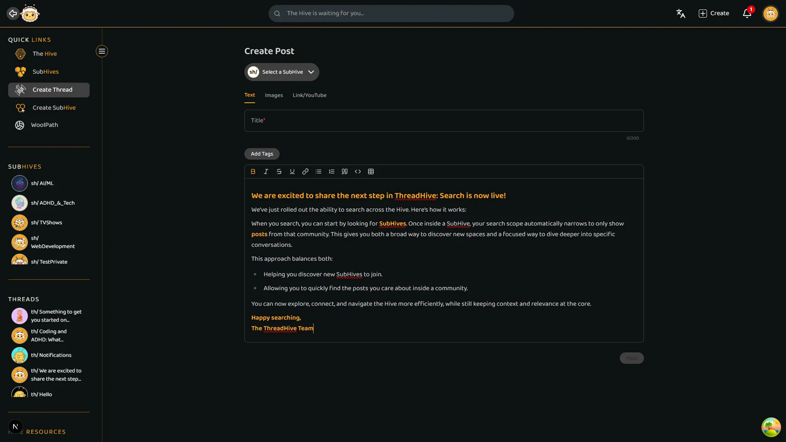
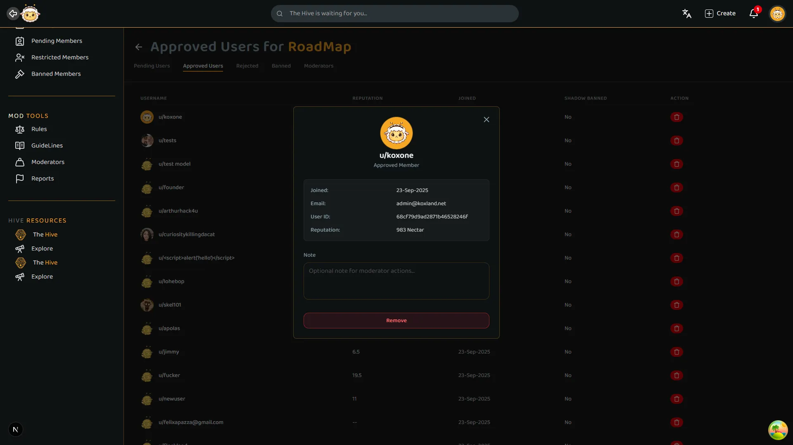

# 🧵 ThreadHive - Modern Community Platform


A **next-generation community platform** that reimagines social discussion with **gamification, visual identity, and real-time interaction**.  
Built with **Next.js 15, MongoDB, Firebase, and advanced state management** for a seamless, engaging user experience.

Featuring **achievement systems (WoolPath), real-time notifications, NSFW detection, rich text editing**, and comprehensive **moderation tools**.

---

## 🚀 Features

### Core Functionality

✅ **Full authentication system** - Register, login, password recovery, password change  
✅ **Advanced post management** - Create, edit, share, delete, vote on posts  
✅ **SubHive communities** - Public, private, NSFW, and official community spaces  
✅ **Rich commenting system** - Create, edit, delete, and vote on comments  
✅ **Real-time notifications** - Firebase-powered instant updates for posts, votes, comments, and memberships  
✅ **Smart search** - Global SubHive search with filtered post search within communities  
✅ **User profiles** - Public and private profiles with follower system  
✅ **Bookmark system** - Save and organize favorite posts  
✅ **Recent activity sidebar** - Quick access to recently visited posts

### Unique Features

🎮 **WoolPath Achievement System** - Collectible badges across multiple tiers (Common → Secret)  
🍯 **Nectar Points** - Comprehensive scoring system rewarding activity and engagement  
🎨 **Strong visual identity** - Professional branding and consistent design language  
🛡️ **Advanced moderation** - Ban, kick, approve/reject members, content removal  
🔍 **NSFW detection** - Automatic content filtering using TensorFlow.js and nsfwjs  
📝 **Rich text editing** - Powered by Tiptap with tables, code blocks, formatting

---

# 🎨 **Brand Identity & Design System**

ThreadHive's complete visual identity was conceptualized and executed as part of the product development process, demonstrating end-to-end product thinking from naming strategy to visual implementation.

---

## 🏷️ **Naming Strategy**

### **ThreadHive - Multi-Layered Brand Narrative**

The name "ThreadHive" creates multiple layers of meaning that reinforce the platform's core values:

#### **Thread Component:**

- **Primary**: Discussion threads, conversation continuity
- **Metaphorical**: Threads that weave communities together
- **Visual Connection**: Wool → Sheep (mascot selection)
- **Community Aspect**: Flock mentality, group cohesion
- **Emotional**: Warmth, comfort, belonging

#### **Hive Component:**

- **Primary**: Collective community space, gathering place
- **Metaphorical**: Organized collaboration, structured community
- **Visual Connection**: Bees → Hard work, rewards (Nectar points system)
- **Activity Aspect**: Busy, productive, engaged users
- **Emotional**: Belonging to something larger

#### **Domain Strategy (.net):**

- **Semantic**: Network, connections, web of relationships
- **Strategic**: Reinforces the "networking" aspect of the platform
- **Branding**: Creates cohesive narrative (not just availability decision)

---

## 🐑 **Mascot Design System**

### **Concept: Sheep in Bee Costume**

A unique hybrid character that visually represents the platform's dual identity.

#### **Design Rationale:**

**Sheep Character Core:**

- Represents the "Thread" aspect through wool
- Symbolizes community (flock animals)
- Conveys warmth, approachability, friendliness
- Non-threatening, inclusive representation

**Bee Costume Elements:**

- Represents the "Hive" aspect
- Symbolizes productivity and rewards (honey/nectar)
- Creates unique, memorable visual identity
- Playful twist makes brand distinctive

#### **Character Versatility:**

The mascot was designed with **multiple emotional states and contexts** to support various platform functions:

**Academic/Learning Variant:**

- Graduation cap, books, lightbulb, quill
- **Use Cases**: Achievement unlocks, tutorials, educational milestones

**Organization Variant:**

- Folders, saved posts, bookmarks, documents
- **Use Cases**: Save features, collections, content organization

**Technical/Responsive Variant:**

- Multiple devices, tools, measurement instruments
- **Use Cases**: Platform updates, multi-device support

**Moderation Variant:**

- Prohibition signs, trash cans, serious expression
- **Use Cases**: Moderation tools, content safety, rule enforcement

**Creator Variant:**

- Pencil, focused expression, productivity symbols
- **Use Cases**: Content creation, editing features, posting

---

## 🏅 **Achievement Badge System - WoolPath**

### **200+ Unique Badge Designs Across 6 Rarity Tiers**

A comprehensive gamification system featuring consistent visual language across all achievement types.

#### **Rarity Tier System:**

| Tier          | Visual Style           | Example Characteristics                        |
| ------------- | ---------------------- | ---------------------------------------------- |
| **Common**    | Bright, simple designs | Basic colors, straightforward symbols          |
| **Uncommon**  | Enhanced details       | Richer colors, more decorative elements        |
| **Rare**      | Complex compositions   | Deep colors, ornate frames                     |
| **Mythic**    | Dramatic elements      | Bold contrasts, special effects                |
| **Legendary** | Dark, powerful imagery | Fire effects, glowing elements, premium frames |
| **Secret**    | Mysterious aesthetics  | Monochrome, hidden symbols, unique styles      |

#### **Example Badges:**

**Legendary Tier - "Inferno Shepherd":**

- Dark sheep with glowing red eyes and flames
- Deep crimson background with dramatic lighting
- Premium gold triple-layered frame
- Represents extreme dedication and platform mastery

**Secret Tier - "Shadow Flock":**

- Monochromatic sheep with stone/metal texture
- Dark grey background with weathered effects
- Represents hidden achievements and discovery-based challenges

#### **Badge Categories:**

- **Activity-Based**: Post creation, comments, votes, engagement streaks
- **Social-Based**: Followers, community building, collaborations
- **Time-Based**: Account age, seasonal events, anniversaries
- **Collection-Based**: Meta-achievements for collecting other badges

---

## 🎨 **Design Process**

### **Creation Workflow:**

**Concept Development:**

- Strategic naming and narrative development
- Mascot concept design and iteration
- Color palette selection
- Badge system architecture

**AI-Assisted Generation:**

- Iterative prompting for consistent style (took several days and many hours)
- Multiple variations generated and refined
- Maintained visual consistency across 200+ unique assets

**Manual Refinement:**

- **Adobe Photoshop**: Detail enhancement, color correction
- **Adobe Illustrator**: Vector refinement, scaling optimization
- Consistency validation across all assets

---

## 💡 **Design Principles**

**Consistency:** Strict visual guidelines ensure brand cohesion across 200+ individual assets

**Scalability:** System designed to support future expansion and new achievement types

**Storytelling:** Each design element reinforces the ThreadHive narrative

**Technical Integration:** All assets optimized for web performance and responsive design

---

## 🎯 **Brand Impact**

**Product Differentiation:**

- Unique identity in crowded social platform space
- Memorable mascot creates instant brand recognition
- Cohesive system strengthens professional credibility

**User Engagement:**

- Badge collection system drives gamification
- Visual consistency creates strong platform identity
- Mascot variations support different platform contexts

---

## 🛠 Tech Stack

### Frontend

| Technology          | Purpose                                     |
| ------------------- | ------------------------------------------- |
| **Next.js 15.3.5**  | App Router, SSR, API Routes                 |
| **React 19**        | Modern UI with latest features              |
| **Tailwind CSS v4** | Utility-first styling with CSS variables    |
| **Framer Motion**   | Smooth animations and transitions           |
| **Tiptap**          | Rich text editor with full formatting       |
| **Redux Toolkit**   | Session and authentication state            |
| **Zustand**         | Internal component state management         |
| **TanStack Query**  | Data fetching, caching, and synchronization |
| **i18next**         | Internationalization (English/Spanish)      |
| **Lucide React**    | Modern icon system                          |

### Backend & Database

| Technology               | Purpose                                             |
| ------------------------ | --------------------------------------------------- |
| **MongoDB Atlas**        | Primary database (users, posts, comments, SubHives) |
| **Mongoose**             | Schema modeling and validation                      |
| **Firebase Firestore**   | Real-time notifications system                      |
| **JWT + Refresh Tokens** | Secure authentication flow                          |
| **bcrypt**               | Password hashing and security                       |

### Infrastructure & Services

| Service                   | Purpose                                |
| ------------------------- | -------------------------------------- |
| **Vercel**                | Hosting, deployment, and custom domain |
| **Vercel Blob**           | Image storage and CDN                  |
| **Resend**                | Transactional email notifications      |
| **Vercel Analytics**      | Performance monitoring                 |
| **Vercel Speed Insights** | Real-time performance metrics          |

### AI & Content Safety

| Technology        | Purpose                                        |
| ----------------- | ---------------------------------------------- |
| **TensorFlow.js** | Client-side ML model execution                 |
| **nsfwjs**        | NSFW content detection (pornography, violence) |
| **Zod**           | Runtime type validation                        |

---

## 📋 Key Features Breakdown

### 🏘️ SubHive System

- **Community types**: Public, Private, NSFW, Official
- **Role-based access**: Owner, Moderator, Member, Banned, Shadowbanned
- **Custom rules**: Editable by owners and moderators
- **Membership management**: Accept/deny join requests for private SubHives
- **NSFW protection**: Automatic blur for sensitive content, member-only access

### 🎯 Gamification & WoolPath

- **Achievement tiers**: Common, Uncommon, Rare, Mythic, Legendary, Secret
- **Badge categories**:
  - Collectible achievements
  - Activity-based rewards
  - Social interaction badges
  - Time-based milestones
- **Nectar points**: Dynamic scoring system based on contributions
- **Profile showcase**: Visible badges, points, and stats on user profiles

### 🔐 Authentication & Security

- **JWT with refresh tokens** stored in HTTP-only cookies
- **Redux-managed session** state with automatic token refresh
- **Protected routes** via Next.js middleware
- **Role-based access control** (admin, moderator, member)
- **Secure password recovery** flow with email verification

### 🔔 Real-Time Notifications

- **Firebase Firestore** for instant notification delivery
- **Event types**:
  - New posts in followed SubHives
  - Vote notifications
  - Comment replies
  - Membership approvals/rejections
- **Resend integration** for email notifications on important events

### 🔨 Moderation Tools

- **Moderator actions**: Ban, kick, accept/reject members, delete content
- **Owner privileges**: Full control over SubHive settings and moderators
- **Custom rule enforcement**: Editable community guidelines
- **Content filtering**: NSFW detection and automatic flagging
- **Shadowban system**: Silent restriction for problematic users

---

## 📂 Project Structure

```
src/
├── app/                          # Next.js 15 App Router
│   ├── api/                      # API Routes
│   │   ├── auth/                 # Authentication endpoints
│   │   │   ├── login/
│   │   │   ├── signup/
│   │   │   ├── refresh/
│   │   │   ├── forgot-password/
│   │   │   └── reset-password/
│   │   ├── posts/                # Post CRUD operations
│   │   │   └── [postid]/
│   │   │       ├── comments/
│   │   │       ├── votes/
│   │   │       └── tags/
│   │   ├── subhives/             # SubHive management
│   │   │   └── [subhiveid]/
│   │   │       ├── join/
│   │   │       ├── leave/
│   │   │       ├── members/
│   │   │       └── moderators/
│   │   ├── profile/              # User profile endpoints
│   │   ├── notifications/        # Real-time notifications
│   │   ├── woolpath/             # Achievement system
│   │   └── upload/               # Image upload to Vercel Blob
│   ├── auth/                     # Auth pages (login, signup, forgot)
│   ├── posts/[postid]/           # Individual post pages
│   ├── subhives/[id]/            # SubHive pages
│   ├── profile/[userid]/         # User profile pages
│   ├── woolpath/                 # Achievement showcase
│   ├── search-mobile/            # Mobile search interface
│   └── settings/                 # User settings
├── components/
│   ├── Features/                 # Feature-specific components
│   │   ├── Auth/
│   │   ├── Badges/
│   │   ├── Nav/
│   │   │   ├── Header/
│   │   │   └── SideBar/
│   │   └── FeedBack/
│   │       └── NotificationsModal/
│   └── Sections/                 # Page-level sections
│       ├── Feed/
│       ├── OpenPost/
│       │   └── Components/
│       │       └── Comments/
│       ├── SubHive/
│       ├── Profile/
│       ├── ModTools/
│       └── WoolPath/
├── models/                       # Mongoose schemas
├── middleware/                   # Auth & admin middleware
├── lib/                          # Utility functions
├── Hooks/                        # Custom React hooks
├── QueryOptions/                 # TanStack Query configurations
├── redux/                        # Redux slices and thunks
│   ├── slices/
│   └── thunks/
├── Zustand/                      # Zustand stores
│   └── Stores/
├── locales/                      # i18n translations
│   ├── en/
│   └── es/
└── Utils/                        # Helper functions
```

---

## ⚡ Getting Started

### Prerequisites

- Node.js 18+
- MongoDB Atlas account
- Firebase project
- Vercel account (for deployment)

### 1️⃣ Clone the repository

```bash
git clone <repository-url>
cd threadhive
```

### 2️⃣ Install dependencies

```bash
npm install
```

### 3️⃣ Configure environment variables

Create a `.env.local` file:

```env
# MongoDB
MONGODB_URI=your_mongodb_atlas_connection_string

# JWT Authentication
JWT_SECRET=your_jwt_secret_key
JWT_REFRESH_SECRET=your_jwt_refresh_secret_key

# Firebase Configuration
NEXT_PUBLIC_FIREBASE_API_KEY=your_firebase_api_key
NEXT_PUBLIC_FIREBASE_AUTH_DOMAIN=your_firebase_auth_domain
NEXT_PUBLIC_FIREBASE_PROJECT_ID=your_firebase_project_id
NEXT_PUBLIC_FIREBASE_STORAGE_BUCKET=your_firebase_storage_bucket
NEXT_PUBLIC_FIREBASE_MESSAGING_SENDER_ID=your_firebase_sender_id
NEXT_PUBLIC_FIREBASE_APP_ID=your_firebase_app_id

# Vercel Blob Storage
BLOB_READ_WRITE_TOKEN=your_vercel_blob_token

# Resend Email
RESEND_API_KEY=your_resend_api_key

# App Configuration
NEXT_PUBLIC_APP_URL=http://localhost:3000
NEXT_PUBLIC_API_URL=http://localhost:3000/api

# Admin Configuration
ADMIN_EMAIL=your_admin_email
```

### 4️⃣ Set up MongoDB

1. Create a MongoDB Atlas cluster
2. Configure network access and database user
3. Copy connection string to `MONGODB_URI`

### 5️⃣ Configure Firebase

1. Create Firebase project
2. Enable Firestore Database
3. Set up security rules for notifications:

```javascript
rules_version = '2';
service cloud.firestore {
  match /databases/{database}/documents {
    match /notifications/{userId}/{document=**} {
      allow read, write: if request.auth != null && request.auth.uid == userId;
    }
  }
}
```

### 6️⃣ Configure Vercel Blob

1. Connect your Vercel project
2. Enable Blob storage
3. Copy the read/write token

### 7️⃣ Set up Resend

1. Create Resend account
2. Verify sending domain
3. Copy API key

### 8️⃣ Run development server

```bash
npm run dev
```

Visit 👉 [http://localhost:3000](http://localhost:3000)

### 9️⃣ Build for production

```bash
npm run build
npm start
```

---

## 🎨 Architecture Highlights

### State Management Strategy

- **Redux Toolkit**: Global authentication state, user session, admin status
- **Zustand**: Component-level state (UI toggles, modals, temporary data)
- **TanStack Query**: Server state management, automatic caching, background refetching

### Authentication Flow

1. User submits credentials → `/api/auth/login`
2. Server validates → generates JWT + Refresh Token
3. Tokens stored in HTTP-only cookies
4. Redux updates session state
5. Middleware protects routes based on auth status
6. Automatic token refresh before expiration

### Real-Time Notification System

1. User action triggers notification creation
2. MongoDB stores notification metadata
3. Firebase Firestore receives real-time update
4. Client subscribed to Firestore collection
5. Notification appears instantly in UI
6. Email sent via Resend for critical notifications

### NSFW Detection Pipeline

1. User uploads image to post/comment
2. Client-side TensorFlow.js runs nsfwjs model
3. Image classified (safe, drawing, hentai, porn, sexy)
4. If NSFW in public SubHive → rejected or flagged
5. If NSFW in NSFW SubHive → accepted with blur
6. Server validates again on upload to Vercel Blob

---

## 📸 Screenshots & Demo

### Platform Overview



### SubHive Community



### WoolPath Achievement System




### Real-Time Notifications




### Rich Text Editor



### Moderation Tools



---

## 🔧 Key Integrations

### MongoDB + Mongoose

- User accounts, profiles, relationships
- Posts with votes, tags, metadata
- Comments with nested replies
- SubHives with members, moderators, rules
- Achievements and point tracking

### Firebase Firestore

- Real-time notification delivery
- Online user presence
- Live activity feeds

### Vercel Blob

- Image uploads with automatic optimization
- CDN delivery for fast loading
- Direct frontend upload with presigned URLs

### Resend

- Password reset emails
- Important notification summaries
- Moderation alerts

### TanStack Query

- Intelligent request deduplication
- Background data synchronization
- Optimistic updates for instant UI
- Persistent cache across sessions

---

## 📱 Mobile Experience

- **Fully responsive design** optimized for mobile devices
- **Touch-friendly interactions** with proper gesture support
- **Pull-to-refresh** on feed and SubHive pages
- **Optimized images** with Next.js automatic optimization
- **Fast navigation** with client-side routing
- **Mobile-first search** with dedicated mobile interface

---

## 🛡️ Security Features

✅ **JWT authentication** with automatic refresh token rotation  
✅ **HTTP-only cookies** preventing XSS attacks  
✅ **bcrypt password hashing** with appropriate salt rounds  
✅ **Role-based access control** at API and route level  
✅ **NSFW content filtering** with AI-powered detection  
✅ **Rate limiting** on sensitive endpoints (planned)  
✅ **Input validation** with Zod schemas  
✅ **Mongoose schema validation** for data integrity  
✅ **MongoDB injection prevention** through Mongoose  
✅ **Shadowban system** for silent moderation

---

## 📈 Performance Optimizations

- **Server-Side Rendering** for fast initial page loads
- **Incremental Static Regeneration** for popular SubHives
- **Image optimization** via Next.js Image component
- **Code splitting** with dynamic imports
- **TanStack Query caching** reducing redundant requests
- **Vercel Edge Network** for global low-latency delivery
- **MongoDB indexing** on frequently queried fields
- **Lazy loading** for heavy components

---

## 🌟 Future Roadmap

🔹 **Direct messaging system** between users  
🔹 **Mobile applications** (iOS/Android with React Native)  
🔹 **Advanced analytics dashboard** for SubHive owners  
🔹 **Public API** for third-party integrations  
🔹 **Marketplace** for trading collectible achievements  
🔹 **Live streaming** integration for community events  
🔹 **AI-powered content recommendations**  
🔹 **Multi-media posts** (video, audio, polls)  
🔹 **Cross-SubHive collaboration** features  
🔹 **Advanced search** with filters and sorting

---

## 🧪 Testing

```bash
# Run tests
npm run test

# Run tests in watch mode
npm run test:watch

# Run tests with coverage
npm run test:coverage
```

---

## 📄 License

**All Rights Reserved**  
© 2025 Carlos de Leon

This project is proprietary and not open source. Unauthorized copying, modification, distribution, or use of this software is strictly prohibited.

---

## 📞 Contact

- **GitHub**: [@Koxone](https://github.com/Koxone)
- **LinkedIn**: [Carlos de Leon](https://www.linkedin.com/in/carlos-d-leon/)

---

### 💡 Why ThreadHive?

ThreadHive represents a **modern evolution of community platforms**, combining:

🎯 **Gamification** - Achievements and points that reward engagement  
🎨 **Visual Identity** - Strong branding and consistent design language  
🔔 **Real-Time** - Instant notifications and live updates  
🛡️ **Smart Moderation** - AI-powered content safety and community tools  
⚡ **Performance** - Built on cutting-edge technologies for speed  
🌍 **Scalability** - Architecture ready for millions of users

---

**Engineered by [Carlos de Leon](https://github.com/Koxone) - Building the future of community engagement.**
