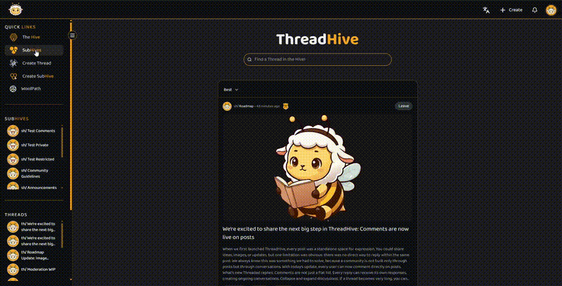

# ThreadHive — Private Repository

This project is part of my professional portfolio.  
The source code is not publicly available since **ThreadHive is developed as a proprietary platform** and the intellectual property is kept private for business reasons.

---

## 🔎 About the Project

ThreadHive is a **community-driven discussion platform** built with:

- **Next.js 15** (frontend & SSR)
- **Tailwind CSS v4** (styling)
- **MongoDB** (database)
- **JWT Authentication** (secure sessions and role-based access)
- **Redux Toolkit & Zustand** (state management)
- **i18n JSON translation system**
- **Framer Motion** (animations)
- **Moment.js** (date formatting)

---

## 🎥 Demo Preview

---

## 🌐 Live Demo

The project will be deployed and made publicly accessible soon.  
👉 Official domain: [threadhive.net](https://threadhive.net) _(coming soon)_

---

## 🤝 Access to the Source Code

If you are a recruiter, potential client, or collaborator and would like to review the codebase, please contact me directly:

- 📧 Email: [admin@koxland.net](mailto:admin@koxland.net)
- 💼 LinkedIn: [linkedin.com/in/carlos-d-leon/](https://www.linkedin.com/in/carlos-d-leon/)

Access to the repository can be granted on request.

---

## 📌 Notes

This repository serves as a placeholder to provide transparency in my portfolio.  
The actual source code is private, but I am happy to provide **live demos, technical walkthroughs, or private code reviews** upon request.

---
